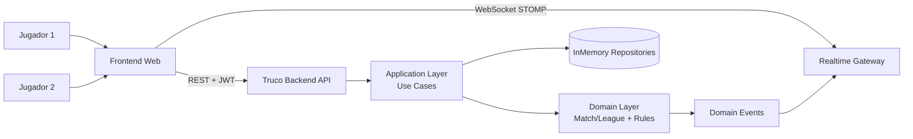

# Truco Master - Backend

Backend de un juego online de Truco Argentino (1v1), disenado para mostrar criterios de arquitectura
y modelado de dominio en un contexto de reglas complejas.

## Estado del proyecto

- Backend funcional.
- API REST + eventos en tiempo real por WebSocket/STOMP.
- CI/CD activa con GitHub Actions (build/test en PR y ramas, release por tags `v*`).
- Analisis estatico externo con SonarQube Community en PR.

## Tabla de contenido

- [Arquitectura](#arquitectura)
- [Decisiones tecnicas](#decisiones-tecnicas)
- [Diagrama C4 (simple)](#diagrama-c4-simple)
- [Stack](#stack)
- [Como correr el proyecto](#como-correr-el-proyecto)
- [Calidad y testing](#calidad-y-testing)
- [Capturas](#capturas)
- [Trade-offs](#trade-offs)
- [Backlog tecnico](#backlog-tecnico)
- [Documentacion API](#documentacion-api)
- [Normas de codificacion](#normas-de-codificacion)

## Arquitectura

El proyecto esta estructurado en capas con enfoque de Clean Architecture:

- `domain`: reglas de negocio puras (agregados, value objects, excepciones, eventos de dominio).
- `application`: casos de uso, comandos/queries, puertos de entrada/salida.
- `infrastructure`: adaptadores HTTP, WebSocket, seguridad JWT, persistencia in-memory y
  configuracion Spring.

La separacion de capas se valida automaticamente con ArchUnit en
`src/test/java/com/villo/truco/architecture/CleanArchitectureTest.java`.

## Decisiones tecnicas

Estas son las decisiones principales del proyecto:

- Clean Architecture con reglas de dependencia validadas por tests de arquitectura.
- DDD tactico para encapsular invariantes del juego:
    - Aggregates: `Match`, `League`.
    - Value Objects: `MatchId`, `PlayerId`, `Card`, `MatchRules`, etc.
    - Domain Events para publicar cambios relevantes del juego.
- Seguridad JWT:
    - Emision de token por jugador.
    - Validacion de `issuer`, `audience` y expiracion.
    - Restriccion de acceso por `matchId` para evitar acceso cruzado entre partidas.
- Tiempo real con STOMP/WebSocket para notificar eventos de la partida.
- Concurrencia controlada en operaciones sensibles (`start match`) mediante lock por partida.
- Persistencia in-memory por alcance inicial del proyecto (rapidez de iteracion y foco en dominio).

## Diagrama C4 (simple)



## Stack

- Java 21
- Spring Boot
- Spring Web
- Spring Security + OAuth2 Resource Server (JWT)
- Spring WebSocket (STOMP)
- Gradle
- JUnit 5 + ArchUnit

## Como correr el proyecto

### Requisitos

- JDK 21

### Comandos

```bash
./gradlew test
./gradlew bootRun
```

En Windows:

```powershell
.\gradlew.bat test
.\gradlew.bat bootRun
```

API local: `http://localhost:8080`

## Calidad y testing

Cobertura de calidad aplicada:

- Tests unitarios de dominio para reglas de Truco/Envido, rondas, scoring y edge cases.
- Tests de concurrencia para inicio simultaneo de partida.
- Tests de seguridad HTTP (JWT, endpoints protegidos, CORS preflight).
- Tests de arquitectura (ArchUnit) para garantizar dependencia correcta entre capas.

## CI/CD y calidad automatizada

Workflows disponibles:

- `CI - Build and Test` (`.github/workflows/ci.yml`):
    - Corre en cualquier `pull_request`.
    - Corre en `push` a cualquier branch.
    - Ejecuta `test` en PR y ramas.
    - Ejecuta `build` en push (no en PR) para evitar build duplicado con Sonar.
- `SonarQube Analysis` (`.github/workflows/sonar.yml`):
    - Corre en cualquier `pull_request`.
    - Ejecuta `clean build sonar` (incluye tests) con quality gate bloqueante.
    - Valida cobertura minima via JaCoCo (`coverageMinimum` o `COVERAGE_MINIMUM`, default `0.70`).
- `Release` (`.github/workflows/release.yml`):
    - Corre al hacer push de tags semanticos `v*`.
    - Publica GitHub Release con el JAR generado.

## Documentacion API

La documentacion de contratos REST, WebSocket, enums y errores se movio a:

- `docs/CONTRATOS_API.md`
